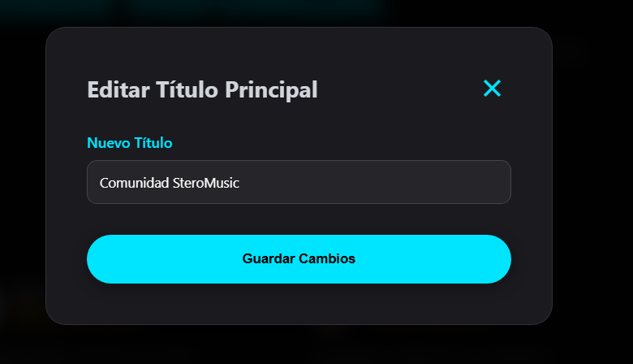
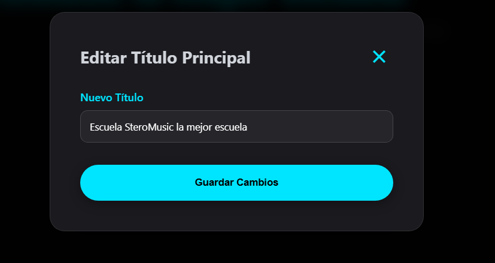

```text
window
└── document
    └── html
        └── body
            ├── div#navbar-shell
            │   └── nav.navbar
            │       └── div.nav-container
            │           ├── a.brand (Logo + Texto)
            │           ├── ul.nav-links
            │           └── div.nav-actions
            │
            ├── div#breadcrumb-shell
            │   └── div.breadcrumb-wrapper
            │       └── nav.breadcrumb-nav
            │
            ├── main#main-content
            │   └── section#testimonialsSection
            │       ├── header.section-header
            │       │   └── div.testimonials-controls
            │       │       ├── button#btnOpenModal
            │       │       └── div.btn-group-mini
            │       │
            │       ├── div#scrollWrapper
            │       │   └── div#testimonialsGrid
            │       │       └── article.testimonial-card
            │       │           ├── button.delete-testimonial
            │       │           ├── div.card-header
            │       │           ├── p
            │       │           └── div.delete-overlay
            │       │
            │       ├── div#hiddenMessage
            │       │
            │       ├── div#testimonialModal
            │       │   └── div.modal-content
            │       │       ├── form#testimonialForm
            │       │       │   ├── input#userName
            │       │       │   ├── div#interactiveStars
            │       │       │   └── textarea#userComment
            │       │       └── div#discardAlert
            │       │
            │       └── div#editTitleModal
            │           └── form#editTitleForm
            │               └── input#newTitleInput
            │
            ├── div#footer-shell
            │   └── footer.footer
            │
            ├── div#theme-modal
            │   └── div.modal-content
            │
            └── scripts
```
# Manipulación del DOM
## Feature: Testimonios

---

## 1 Actualización de Títulos

**Elemento:** `h1#mainTitle` (manipulado por `button#btnEditTitle`)

**Acción:**
Cambio de texto mediante la propiedad `.textContent`.

**Propósito:**
Implementación básica de dentro del CRUD visual.
Permite que la interfaz se adapte al contexto del usuario en tiempo real sin necesidad de recargar la página.

<div align="center">
  
  <br>
  <sub>dentro del input se retorna el valor del título gracias al código:</sub>
</div>

```javascript

const mainTitleNode = document.getElementById('mainTitle')
document.getElementById('btnEditTitle').onclick = function () {
    newTitleInput.value = mainTitleNode.textContent.trim();

    editTitleModal.classList.remove('hidden');
    anime({
        targets: editTitleModal.querySelector('.modal-content'),
        scale: [0.8, 1],
        opacity: [0, 1],
        duration: 400,
        easing: 'easeOutBack'
    });
};

```
al dar aceptar se activa el código:

```javascript

  editTitleForm.onsubmit = (e) => {
        e.preventDefault();
        const nuevoTitulo = newTitleInput.value.trim();
        if (nuevoTitulo) {
            mainTitleNode.textContent = nuevoTitulo + " ";
        }
        closeTitleModal();
    };

```

<div align="center">
  
  <br>
  <sub>actualizamos el input del título</sub>
</div>
</br>
<div align="center">
  
  <br>
  <sub> Tenemos el título modificado</sub>
</div>

## 2 Control de Visibilidad

**Elementos:**
- `div#scrollWrapper` (contenedor)
- `div#hiddenMessage`

**Acción:**
Alternancia de clases CSS (por ejemplo `.hidden`) y manipulación de propiedades como `display` u `opacity`.

**Propósito:**
Optimización de la experiencia de usuario (UX).
Funciona como un *filtro de privacidad visual*: el contenido se remueve del flujo visible, pero permanece intacto en memoria dentro del navegador.

---

## 3 Gestión de Temas

**Elementos:**
- Nodo `body`
- `span#mode-icon`

**Acción:**
- Intercambio de Variables CSS (`--bg`, `--primary-color`)
- Actualización de clases para iconos (`light_mode` ↔ `dark_mode`)

**Propósito:**
Accesibilidad y personalización.
Se manipula el **CSSOM (CSS Object Model)** junto con el DOM para transformar la identidad visual completa de la aplicación en milisegundos.

---

## 4 Inyección Dinámica de Datos

**Elemento:** `article.testimonial-card`

**Acción:**
inserta en el array nuevos datos para la card
**Propósito:**
Base del desarrollo frontend moderno.
En lugar de codificar múltiples tarjetas manualmente, se utiliza una función que actúa como un Factory Pattern visual, generando el HTML dinámicamente a partir de un arreglo de datos o una API.

## 5️ Eliminación

**Elementos**:
```
button.delete-testimonial
```

**Nodo** .delete-overlay

**Acción**:
 elemina un elemento del array de datos.

# Reflexión

---

## ¿Qué diferencia hay entre un sitio estático y uno dinámico desde la perspectiva del usuario?

Desde el punto de vista del usuario:

- **Sitio estático:**
  El contenido no cambia a menos que se recargue la página. Cada interacción generalmente implica una nueva carga completa del sitio. La experiencia es más simple y menos interactiva.

- **Sitio dinámico:**
  El contenido puede cambiar en tiempo real sin recargar la página. El usuario puede interactuar (agregar, editar, eliminar información) y ver los cambios inmediatamente, lo que hace que la experiencia sea más fluida e interactiva.


---

## ¿Cómo mejora la manipulación del DOM la experiencia del usuario?

La manipulación del DOM permite:

- Actualizar contenido al instante.
- Mostrar u ocultar elementos según la interacción.
- Cambiar estilos (como modo oscuro/claro) en tiempo real.
- Agregar o eliminar componentes dinámicamente.

Esto mejora la experiencia porque:

- Reduce tiempos de espera.
- Evita recargas innecesarias.
- Hace que la interfaz responda inmediatamente a las acciones del usuario.
- Genera una sensación de aplicación más profesional y moderna.

---

##  ¿Qué dificultades encontraste al manipular el DOM y cómo las superaste?

- Seleccionar correctamente los elementos.
- Evitar errores cuando un elemento no existe.
- Manejar eventos sin que se ejecuten múltiples veces.
- Controlar cambios visuales sin romper el diseño.
